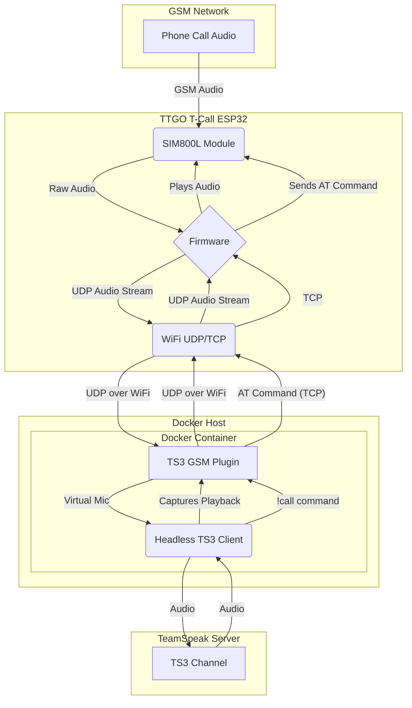

# TeamSpeak GSM Call Gateway

[](https://github.com/mkenney/software-guides/blob/master/STABILITY-BADGES.md#experimental)
[](https://opensource.org/licenses/MIT)

This project transforms a TTGO T-Call ESP32 board into a GSM gateway for TeamSpeak 3. It allows you to make and receive phone calls directly from a TeamSpeak channel. The system is composed of four parts:

1.  **Firmware:** Runs on the TTGO T-Call board, handling the GSM connection and audio streaming over WiFi.
2.  **TeamSpeak Plugin:** A plugin for the TS3 client that creates a custom audio device to bridge the audio between the TTGO and the TeamSpeak server.
3.  **Docker Headless Client:** A pre-configured Docker environment that runs a headless TeamSpeak client with the plugin, allowing the gateway to run 24/7 on a server.
4. **TTGO Call**: something like TTGO T-Call V1.3 ESP32 with SIM800L to handle the calls on the GSM network. 

## Architecture

The system works by creating an audio bridge between the GSM network and a TeamSpeak channel.

1.  The **TTGO T-Call** board uses its SIM800L module to handle GSM phone calls.
2.  When a call is active, the firmware captures the audio from the microphone and streams it via UDP to the TeamSpeak plugin.
3.  Simultaneously, it receives UDP audio streams from the plugin and plays them back into the phone call.
4.  The **TeamSpeak Plugin**, running inside a headless client in a Docker container, creates a virtual audio device.
5.  It receives the audio from the TTGO and injects it into the TeamSpeak channel as if it were a user speaking.
6.  It captures the audio from the TeamSpeak channel (other users talking) and sends it back to the TTGO via UDP.
7.  A TCP channel is also established for sending AT commands (e.g., to dial a number) from TeamSpeak to the TTGO.



## Installation

The recommended way to run this project is by using the provided Docker environment. A manual setup is also possible for development and testing.

### Docker (Recommended)

This method builds the plugin and runs the TeamSpeak client in a headless container.

**Prerequisites:**
*   Docker
*   Docker Compose

**Steps:**

1.  **Clone the repository:**
    ```bash
    git clone https://github.com/fabbrus97/teamspeak3-gsm
    cd new_ts_call_bot
    ```

2.  **Configure the Environment:**
    Create a `.env` file by copying the example:
    ```bash
    cp docker/.env.example docker/.env
    ```
    Edit `docker/.env` and fill in your TeamSpeak server details:
    ```
    TS_URL=your_server_address
    TS_CHANNEL=YourChannelName
    TS_NICKNAME=GSMGatewayBot
    ```

3.  **Build and Run the Container:**
    Use `docker-compose` to build and start the service in the background.
    ```bash
    docker-compose -f docker/docker-compose.yaml up --build -d
    ```
    The bot should now connect to your TeamSpeak server.

4. In order to setup the firmware for the TTGO, see below Manual Installation. 

### Manual Installation

A manual installation requires you to compile the firmware and the plugin separately.

#### 1. TTGO T-Call Firmware

**Prerequisites:**
*   Arduino IDE or VSCode with PlatformIO.
*   ESP32 Board support for Arduino.
*   TinyGSM library.

**Steps:**

1.  Open the `ttgo/main/main.ino` sketch.
2.  **Configure networking:** Modify the following variables in `ttgo/main/main.ino` and `ttgo/main/TSutils.cpp` to match your network settings and the IP address of the machine running the TS3 plugin.
3.  Compile and upload the firmware to your TTGO T-Call board.

#### 2. TeamSpeak Plugin

**Prerequisites:**
*   `gcc` and `make`.
*   TeamSpeak 3 Client SDK (the project includes the necessary headers).
*   `libsoxr-dev`, `libiniparser-dev`.

**Steps:**

1.  **Compile the plugin:**
    Navigate to the plugin directory and run `make`.
    ```bash
    cd ts3client-pluginsdk
    make
    ```
    This will produce a `callbot.so` file in the `ts3client-pluginsdk` directory.

2.  **Install the plugin:**
    Copy `callbot.so` to your TeamSpeak client's plugin directory (e.g., `~/.ts3client/plugins`).

3.  **Configure the plugin:**
    Create a `settings.ini` file in your TS3 client's configuration directory (e.g., `~/.ts3client/`) based on `ts3client-pluginsdk/settings.ini.example`. Adjust the IP and port to point to your TTGO device.

## Usage

Once the system is running, you can interact with it via chat commands in the TeamSpeak channel where the bot is located.

*   **Dial a number:**
    ```
    !call ATD+123456789;
    ```
*   **Hang up:**
    ```
    !call ATH
    ```
*   **Answer an incoming call:** The firmware is configured to automatically answer incoming calls (`ATA`).

Any standard GSM AT command can be sent to the device. The response from the modem will be printed back to the channel.

## Configuration Reference

This is a complete list of variables you may need to change.

| File | Variable | Description |
| --- | --- | --- |
| **Docker** | | |
| `docker/.env` | `TS_URL` | Address of the TeamSpeak server (e.g., `myts.server.com`). |
| | `TS_CHANNEL` | The channel name for the bot to join. |
| | `TS_NICKNAME` | The nickname for the bot on TeamSpeak. |
| `docker/docker-compose.yaml` | `ports` | Host/container port mapping. The default `8078:8000/udp` exposes the plugin's listening port `8000` on the host's port `8078`. |
| **TeamSpeak Plugin** | | |
| `ts3client-pluginsdk/settings.ini`| `ip` | IP address of the TTGO T-Call device. |
| | `at_port` | The TCP port for sending AT commands to the TTGO (default `8001`). |
| **Firmware** | | |
| `ttgo/main/main.ino` | `ssid` | The SSID of the WiFi network for the TTGO. |
| | `password`| The password for the WiFi network. |
| | `staticIP` | The static IP address for the TTGO device itself. |
| | `gateway` | The gateway IP for the local network. |
| `ttgo/main/TSutils.cpp` | `serverAddress` | The IP address of the host running the TeamSpeak plugin (your Docker host). |
| | `serverPort` | The UDP port to send audio to (must match the host port in `docker-compose.yaml`, e.g., `8078`). |
| | `cmdPort` | The TCP port where the firmware listens for AT commands (default `8001`). |

---
*This documentation was generated with the help of an AI assistant.*